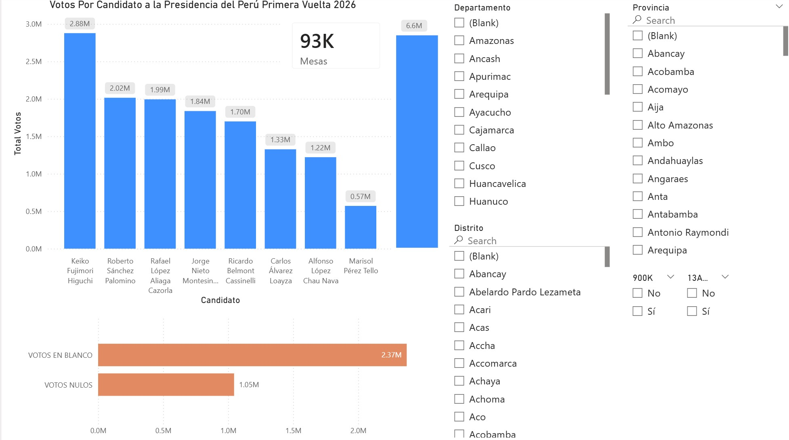
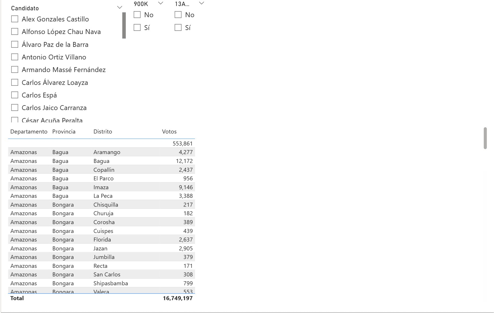
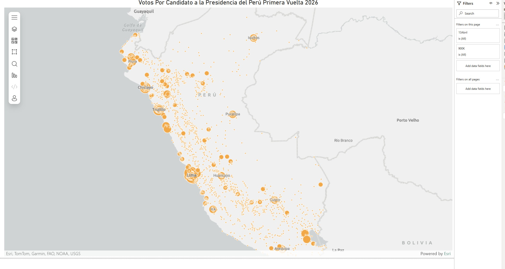

# PeruVoto 2026

Analítico básico para transparencia electoral en Perú, construido sobre data pública de ONPE y alimentado por el output del scraper:

Los resultados expuestos corresponden a las votaciones de candidatos a la Presidencia del Perú en la primera vuelta de 2026.

- https://github.com/oscarzamora/onpeescraper

Este repositorio concentra dos entregables:

1. Reporte Power BI: `reports/onpe_peru_2026-1.pbix`
2. Reporte Excel (Power Query + pivotes): `reports/onpe_peru_2026-1.xlsx`

Ambos archivos de reporte ya están apuntando a la fuente de datos pública proveniente de `onpeescraper` (archivos de `output/` y apoyo de `source_data/`).

## Actualización reciente

Se actualizó `reports/onpe_peru_2026-1.xlsx`.

Ahora se expone explícitamente que `onpeescraper` también provee ubigeo para extranjero, y que Power Query ya incluye esa información dentro del flujo de transformación.

También se incorpora que `onpeescraper` ahora provee dos fuentes adicionales para análisis de extranjero:

- `output/extranjero-ubigeo-continente-pais-ciudad.csv`
- `output/extranjero-continente-pais-ciudad-lat-lon.csv`

Respecto al cruce de ubigeos del Perú, existen muy pocos casos sin correspondencia. La causa más probable es desactualización del catálogo RENIEC usado como referencia. Fuera de esos casos puntuales, el resto del flujo y de los resultados se mantiene igual.

## Objetivo

Poner a disposición de cualquier ciudadano una forma simple de explorar la data electoral pública, con foco en:

- Transparencia
- Trazabilidad de origen
- Reproducibilidad del análisis

## Fuente de datos

La fuente de verdad de este proyecto es el directorio `output/` generado por onpeescraper, en particular:

- `output/mesas_data.txt`
- `output/votos.txt`
- `output/agrupaciones.txt`
- `output/extranjero-ubigeo-continente-pais-ciudad.csv`
- `output/extranjero-continente-pais-ciudad-lat-lon.csv`

Como insumos de apoyo para enriquecimiento:

- `source_data/geodir-ubigeo-reniec.xlsx`
- `source_data/candidato.txt` (mapeo manual opcional)

Todo lo anterior proviene de data pública.

En este proyecto, `onpeescraper` ya está corrido: aquí no se ejecuta scraping.
Se usa únicamente como fuente de datos de entrada para el analítico.

## Flujo recomendado

No se requiere correr ningún proceso adicional para usar este repositorio.
Los reportes ya están predeterminados y apuntan a la fuente pública de datos de `onpeescraper`.

Operación habitual:

1. Abrir `reports/onpe_peru_2026-1.xlsx` y refrescar Power Query.
2. Abrir `reports/onpe_peru_2026-1.pbix` y refrescar el modelo.

## Estructura actual

```
peruvoto2026/
|-- README.md
|-- assets/
|   |-- 1-PanelGeneral.jpg
|   |-- 2-PanelCandidatos.jpg
|   `-- 3-MapaPeru.jpg
|-- reports/
    |-- onpe_peru_2026-1.pbix
    `-- onpe_peru_2026-1.xlsx
```

## Reporte Power BI

`reports/onpe_peru_2026-1.pbix` representa 3 vistas principales (ver screenshots):

1. Panel general
2. Panel de candidatos
3. Mapa Perú

Adicionalmente, el reporte incluye filtros predeterminados para:

- Mesas 900K
- Mesas que abrieron el 13 de abril

Esto permite revisar esos subconjuntos de forma directa para los suspicaces, sin tener que armar filtros manuales desde cero.

## Reporte Excel

`reports/onpe_peru_2026-1.xlsx` contiene:

- Power Query para ingesta y transformación básica del output del scraper.
- Tablas dinámicas para analítica simple por candidato y geografía.

## Nota de transparencia

Este repositorio no inventa data electoral ni reemplaza resultados oficiales. Solo organiza y visualiza data pública para facilitar su lectura y fiscalización ciudadana.

## Screenshots finales

### 1. Panel General



### 2. Panel Candidatos



### 3. Mapa Peru




