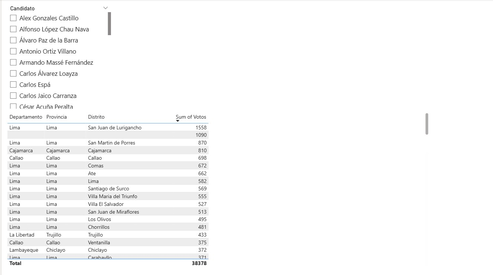
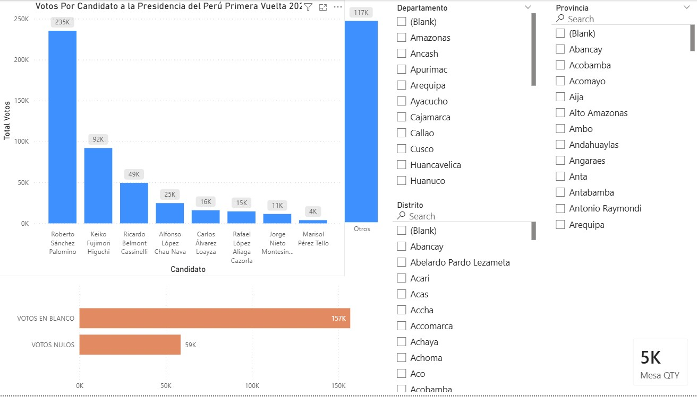
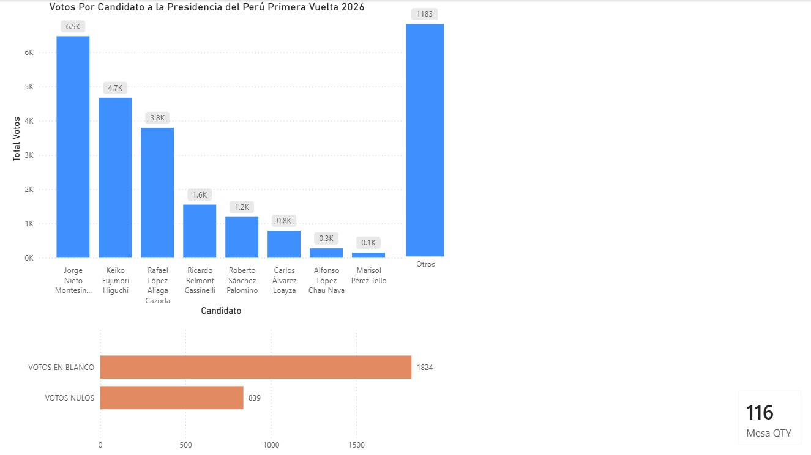
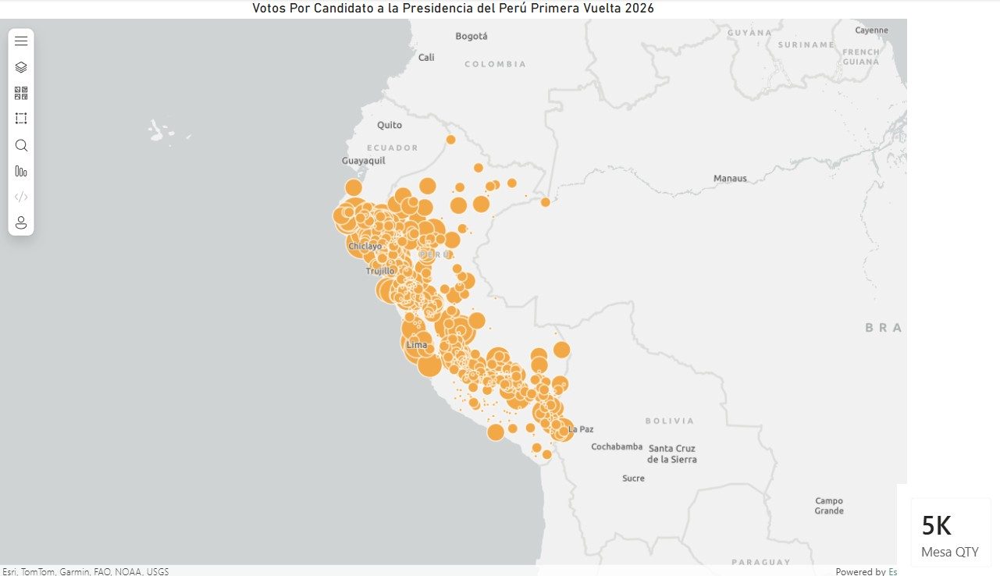

# Propósito y Contexto

Este repositorio expone un **snapshot del 20 de abril de 2026** del conteo de la **primera vuelta de las Elecciones Generales Presidenciales del Perú 2026**, basado en datos públicos de la ONPE (Oficina Nacional de Procesos Electorales).

### Intención
- **Transparencia**: Exponer con claridad lo que la data nos dice sobre el estado del conteo electoral
- **Acceso abierto**: Permitir que cualquier veedor pueda analizar, validar e interpretar los resultados
- **Evitar malinterpretaciones**: Proporcionar herramientas visuales y datos estructurados para análisis riguroso
- **Extensibilidad**: Los usuarios pueden crear nuevos reportes, hacer browse de los datos y realizar análisis más exhaustivos

### Datos disponibles
Los datos incluidos corresponden a la captura oficial del **20 de abril de 2026** (timestamp: 20260420T074202Z).

**Nota importante:** Si existe una versión más actualizada de los datos en las fuentes originales (Hugging Face, ONPE), se recomienda descargarla y reemplazar los archivos locales en `data/` para análisis con información más reciente.

### Cómo usar este repositorio
1. Explora los 5 paneles del reporte Power BI (`reports/onpe.pbix`) para visualizaciones de alto nivel
2. Accede a los datos brutos en `data/` para análisis independientes
3. Crea tus propios reportes expandiendo el PBIX o usando herramientas externas
4. Comparte hallazgos, validaciones o reportes adicionales como contribuciones

## Origen de la data (fuente oficial)

Este repositorio incluye copias locales de archivos descargados desde fuentes externas.
La procedencia exacta es la siguiente:

| Archivo local en este repo | Origen exacto | Referencia de formato |
|---|---|---|
| data/onpe_eg2026_mesas_20260420T074202Z.csv | https://huggingface.co/datasets/Neuracode/onpe-eg2026-mesa-a-mesa/blob/main/onpe_eg2026_mesas_20260420T074202Z.csv | https://huggingface.co/datasets/Neuracode/onpe-eg2026-mesa-a-mesa/blob/main/README.md |
| data/geodir-ubigeo-reniec.xlsx | https://account.geodir.co/resources/file/recursos/geodir-ubigeo-reniec.xlsx | [docs/fuente_datos_ubigeo_reniec.md](docs/fuente_datos_ubigeo_reniec.md) |

Referencias principales del dataset electoral:

- https://huggingface.co/datasets/Neuracode/onpe-eg2026-mesa-a-mesa
- https://huggingface.co/datasets/Neuracode/onpe-eg2026-mesa-a-mesa/tree/main

## Estructura

- reports/ - archivos .pbix y .pbit
- data/ - archivos de datos locales
- docs/ - notas, requerimientos y decisiones

## Documentacion de datos

- CSV ONPE EG2026: [docs/fuente_datos_onpe_eg2026.md](docs/fuente_datos_onpe_eg2026.md)
- XLSX ubigeo RENIEC: [docs/fuente_datos_ubigeo_reniec.md](docs/fuente_datos_ubigeo_reniec.md)

## Contenido del reporte

### Panel General
Expone los votos recibidos por todos los candidatos en la primera vuelta de las Elecciones Generales 2026 del Perú.
Incluye filtros por:
- Departamento
- Provincia  
- Distrito

También muestra métricas de votos en blanco, votos nulos y cantidad total de mesas.

### Panel Candidato
Expone todos los candidatos presidenciales disponibles con la capacidad de filtrar por candidato.
Incluye tabla detallada que muestra:
- Departamento
- Provincia
- Distrito
- Suma de votos por lugar

Permite análisis granular de los votos por localidad geográfica para cada candidato.

### Panel Mesas 900K
Expone los votos recibidos en las mesas especiales (900K+) que incluyen centros excepcionales como universidades, ESSALUD e instituciones educativas distribuidas.
Muestra:
- Votos por candidato en mesas especiales
- Filtros por Departamento, Provincia y Distrito
- Todas las localidades dentro del universo de mesas 900K
- Métricas de votos en blanco y nulos específicas para mesas especiales

### Panel 13 de Abril
Expone los resultados de las mesas que se abrieron el 13 de abril de 2026.
Incluye:
- Votos por candidato en la fecha del 13 de abril
- Gráfico de distribución de votos por candidato
- Métricas de votos en blanco y nulos
- Cantidad total de mesas abiertas en esa fecha (Mesa QTY)

### Panel Mapa 900K
Visualización geográfica de las mesas especiales 900K+ que han generado controversia en la auditoría electoral.
Muestra:
- Ubicación exacta de todas las mesas 900K en el territorio peruano
- Puntos geográficos basados en coordenadas RENIEC (latitud/longitud)
- Distribución a nivel nacional con cobertura en todos los departamentos
- Identificación visual de centros excepcionales (universidades, ESSALUD, instituciones educativas)
- Datos de referencia cartográfica: Esri, TomTom, Garmin, FAO, NOAA, USGS

## Galería de Paneles

### 1. Panel General
Visión consolidada de votos por candidato con filtros geográficos (Departamento, Provincia, Distrito).
Incluye métricas de votos en blanco y nulos.

### 2. Panel Candidato
Análisis granular con tabla de votos por localidad para cada candidato.
Permite filtrar por candidato y explorar resultados por distrito.

### 3. Panel Mesas 900K
Análisis específico de mesas especiales con distribución de votos.
Cobertura de centros excepcionales (universidades, ESSALUD, IE distribuidas).

### 4. Panel 13 de Abril
Resultados específicos de la fecha de apertura de mesas.
Histórico de conteo a fecha específica.

### 5. Panel Mapa 900K
Visualización geográfica con puntos de coordenadas exactas.

## Inicio rápido

1. Coloca tus archivos de reporte de Power BI en reports/.
2. Haz commit de los cambios.
3. Haz push a tu repositorio remoto de Git.
